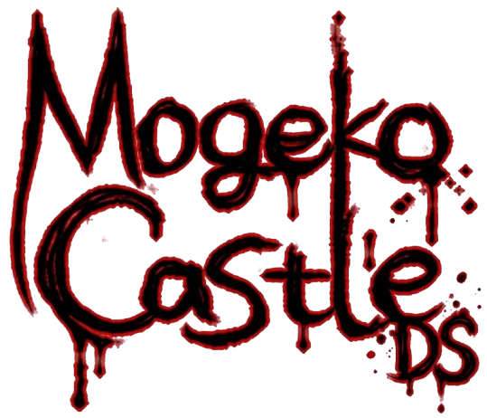
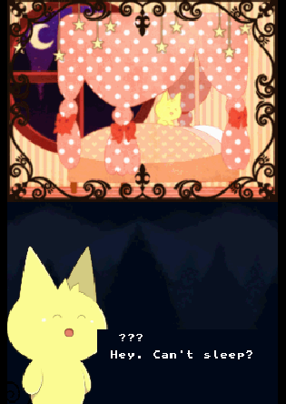

<p align="center">
  
</p>

<h4 align="center">A Nintendo DS homebrew recreation of <a href="http://funamusea.com/" target="_blank">Mogeko Castle</a>.</h4>

<p align="center">
  <a href="https://www.gnu.org/licenses/gpl-3.0">
    
  </a>
  <a href="https://devkitpro.org">
    
  </a>
  <a href="#">
    
  </a>
</p>

<p align="center">
  <a href="#about">About</a> •
  <a href="#features">Features</a> •
  <a href="#tech-stack">Tech Stack</a> •
  <a href="#project-structure">Structure</a> •
  <a href="#getting-started">Getting Started</a> •
  <a href="#credits">Credits</a> •
  <a href="#license">License</a>
</p>

<p align="center">
  
</p>

---

## About

**Mogeko DS** is a homebrew recreation of [Mogeko Castle](https://funamusea.com/) for the Nintendo DS, built from scratch in C. The original game is a surreal indie RPG by [Deep-Sea Prisoner](https://funamusea.com/) (Funamusea) about a high schooler named Yonaka who takes a train and ends up in a bizarre castle populated by strange cat-like creatures called "Mogeko."

This project reimplements the game's core systems for the DS hardware: dual-engine rendering, OAM sprite menus, typewriter dialog, and audio playback via maxmod.

> **Disclaimer:** This is a non-profit fan project. All original game assets (art, music, characters, and story) belong to **Deep-Sea Prisoner / Funamusea** and are used here without explicit permission. This project is not affiliated with or endorsed by the original creator. If you are the rights holder and wish for this project to be removed, please open an issue.

## Features

- **Title Screen** — Animated menu with OAM sprite navigation (D-pad + A button)
- **Intro Sequence** — Multi-phase opening with fade transitions, logo display, and warning screens
- **Typewriter Dialog** — Character-by-character text reveal with adjustable speed, A-button skip, and text bleep SFX
- **Audio System** — Music playback (.MOD) and sound effects (.WAV) via maxmod with volume and panning control
- **Dual-Engine Rendering** — Simultaneous use of main and sub screens (MODE_5_2D) for backgrounds, sprites, and dialog
- **Scene Management** — Clean scene lifecycle with init/update/cleanup and transition system
- **Fade Effects** — Software-driven brightness ramping for smooth visual transitions
- **Character Portraits** — Dynamic portrait loading on the sub screen during dialog

## Tech Stack

| Technology | Purpose |
|---|---|
| [devkitPro](https://devkitpro.org/) / devkitARM | ARM cross-compiler toolchain |
| [libnds](https://devkitpro.org/viewtopic.php?t=1) | Nintendo DS hardware abstraction |
| [calico](https://github.com/Gericom/calico) | Additional NDS utilities (IRQ handling) |
| [maxmod](https://www.maxmod.org/) | Audio engine for music (.MOD) and SFX (.WAV) |
| [grit](https://www.coranac.com/projects/grit/) | Graphics conversion (PNG → DS tile/bitmap data) |
| [melonDS](https://melonds.kuribo64.net/) | Nintendo DS emulator for testing |

## Project Structure

```
mogeko-ds/
├── src/
│   ├── main.c                  # Entry point, main loop
│   ├── core/                   # Engine systems
│   │   ├── game.c              # Hardware init, VRAM, OAM, scene dispatch
│   │   ├── scene_manager.c     # Scene transitions
│   │   ├── graphics.c          # Image loading, fade effects
│   │   ├── audio.c             # Music & SFX playback
│   │   └── dialog.c            # Typewriter dialog engine
│   ├── scenes/                 # Game scenes
│   │   ├── title_screen.c      # Title screen with OAM menu
│   │   └── intro.c             # Multi-phase intro sequence
│   ├── assets/                 # Asset registries
│   │   ├── backgrounds.c       # Background image descriptors
│   │   └── characters.c        # Character portrait descriptors
│   └── entities/
│       └── yonaka_spr.c        # Yonaka sprite initialization
├── include/                    # Header files (mirrors src/ structure)
├── gfx/
│   ├── bg/                     # Background PNGs (8-bit, 256x256)
│   └── spr/                    # Sprite PNGs (16-color, 64x32)
├── maxmod_data/                # Audio assets (.MOD, .WAV)
├── scripts/
│   └── reduce_colors.sh        # ImageMagick color reduction helper
├── Makefile                    # devkitPro build system
└── icon.bmp                    # NDS cartridge icon
```

## Getting Started

### Prerequisites

Install [devkitPro](https://devkitpro.org/wiki/Getting_Started) with the following packages:

```bash
# Install devkitPro pacman
dkp-pacman -Sy

# Install required tools
dkp-pacman -S nds-dev
```

### Build

```bash
make
```

This produces `mogeko-ds.nds`.

### Run (melonDS)

```bash
make run
```

Requires [melonDS](https://melonds.kuribo64.net/) installed via Flatpak or system package manager.

### Clean

```bash
make clean
```

## Credits

- **Original Game** — [Mogeko Castle](https://funamusea.com/) by [Deep-Sea Prisoner](https://funamusea.com/) (Funamusea)
- **DS Homebrew Libraries** — [devkitPro](https://devkitpro.org/), [libnds](https://devkitpro.org/), [calico](https://github.com/Gericom/calico), [maxmod](https://www.maxmod.org/)

## License

This project is licensed under the [GNU General Public License v3.0](LICENSE).

> **Note:** The source code is open source under GPL v3. Original game assets (art, music, story) are the intellectual property of Deep-Sea Prisoner / Funamusea and are not covered by this license.

---

<p align="center">
  Made with love for the DS homebrew community
</p>
